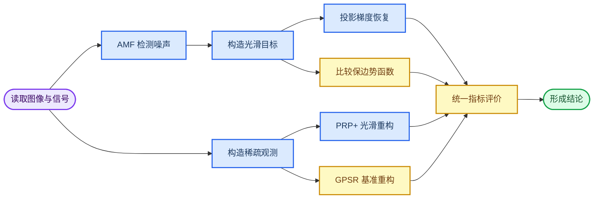

# 信号重构问题：题目分析与建模方案

_依据《第二期第三个练习题目》及“参考文献及测试图片”目录整理 · 2026-09-02_

## 📌 摘要

本题围绕两个典型信号重构任务展开：椒盐噪声图像恢复与压缩感知中的稀疏信号重构。三问并非相互独立：问题一先建立“噪声检测 + 连续优化恢复”的基本框架；问题二研究正则项中保边势函数的选择；问题三把光滑化思想迁移到含有 $\ell_1$ 范数的稀疏重构模型，并比较修正 PRP 共轭梯度法与 GPSR。

建议全文以“光滑近似 + 一阶优化 + 对照实验”为主线。图像部分用自适应中值滤波器（AMF）识别污染集合 $\Omega$，再对 $\Omega$ 内像素求解带箱约束的光滑化模型；信号部分用光滑函数逼近 $\ell_1$ 范数，使 PRP+ 可以直接使用梯度，并与求解原始 $\ell_1$ 模型的 GPSR 公平比较。最终结论必须同时基于恢复质量、计算效率和稳定性，不能只比较一张恢复图或一次运行时间。

**关键词：** 椒盐噪声；图像恢复；保边正则化；光滑化；投影梯度；PRP+；GPSR；稀疏重构

---

## 🧭 总体分析

### 三问之间的逻辑关系

### 题目要求拆解

| 问题  | 核心任务                        | 数学难点                   | 建议产出                  |
| --- | --------------------------- | ---------------------- | --------------------- |
| 问题一 | 建立椒盐噪声图像的光滑化恢复模型，并用投影梯度算法求解 | 非光滑数据保真项、邻域耦合、箱约束      | 模型、梯度、算法、30%/50% 噪声实验 |
| 问题二 | 比较五类保边势函数                   | 参数含义不同，不能直接用同一数值比较     | 函数性质、参数标定、质量与效率比较     |
| 问题三 | 用修正 PRP 算法重构稀疏信号，并与 GPSR 比较 | $\ell_1$ 不可微、线搜索、比较公平性 | 光滑模型、PRP+、GPSR、重复试验   |

### 题面中的符号与引用问题

1. 题面把“两阶段图像恢复方法”标成文献 [1]，但附件文献 [1] 实际是 GPSR；AMF 两阶段方法主要对应文献 [2]，其简化恢复泛函及势函数性质主要对应文献 [3]。[^1][^2][^3]
2. 题面公式（2）的第一层求和下标经 DOCX 公式还原后显示为 $N$，结合原论文应为噪声候选集合 $\Omega$ 或 $\mathcal N$。[^3]
3. 题面中 $S_2$ 的邻域差写成了 $u_{i,j}-y_{m,n}$；当邻点也属于噪声集合时，原论文使用的是 $u_{i,j}-u_{m,n}$。[^3]
4. 第三个势函数应为 $\log(\cosh(\alpha t))$，题面正文提取时丢失了变量 $t$。[^3]
5. 问题三只给出信号长度与非零元素数，文献 [1] 的相应实验还规定了观测维数、测量矩阵、噪声和正则化参数；这些条件应补入复现实验。[^1]

---

## 🧮 三问模型细化：目标函数 · 约束 · 算法 · 白盒/黑盒

### 白盒与黑盒的判定标准

优化算法按其利用目标函数信息的程度分为两类：

- **白盒算法**：目标函数解析表达式已知，算法直接利用其梯度（或 Hessian、可行集投影结构）构造迭代方向，如梯度法、牛顿法、非线性共轭梯度法、投影梯度法、近端梯度法。
- **黑盒算法**：把目标函数当作只能查询函数值的"黑箱"，不使用导数与解析结构，如遗传算法、粒子群、模拟退火、Nelder–Mead 单纯形法、贝叶斯优化。

本题三问的**内层求解算法全部是白盒一阶算法**，理由有三：

1. 目标函数解析已知且（光滑化后）可导，梯度有闭式表达式；
2. 决策变量维数极高——50% 噪声下 $512\times512$ 图像的 $\Omega$ 可达十余万维，问题三为 4096 维——黑盒元启发式每代需评估几十上百个个体，此规模下计算上不可行；
3. 题面点名的方法（PRP 共轭梯度、GPSR 投影梯度）本身就是白盒梯度类算法。

唯一涉及"黑盒式评估"的环节是问题二外层的超参数选择：验证集指标对超参数没有梯度，只能逐组试算，属于低维黑盒网格搜索。

### 问题一：箱约束光滑凸优化 + 投影梯度

| 要素   | 内容                                                             |
| ---- | -------------------------------------------------------------- |
| 决策变量 | 噪声像素灰度 $U_\Omega=\{u_{i,j}:(i,j)\in\Omega\}$，$\Omega$ 由 AMF 检出 |
| 已知参数 | 观测图 $Y$、集合 $\Omega$、正则强度 $\beta$、光滑参数 $\mu$、势函数 $\phi_\alpha$  |
| 目标函数 | 光滑 $\ell_1$ 数据项 + 势函数正则项（见下式）                                  |
| 约束   | 箱约束 $s_{\min}\le u_{i,j}\le s_{\max},\ (i,j)\in\Omega$         |
| 问题性质 | 连续、光滑、**凸**、梯度 Lipschitz；维数$=\|\Omega\|$（数万至十余万）               |

$$
\min_{U_\Omega}\;
\underbrace{\sum_{(i,j)\in\Omega}\psi_\mu(u_{i,j}-y_{i,j})}_{\text{光滑数据保真}}
+\underbrace{\frac{\beta}{2}\sum_{(i,j)\in\Omega}\sum_{(m,n)\in\mathcal V_{i,j}}\phi_\alpha(u_{i,j}-v_{m,n})}_{\text{保边正则}}
\quad\text{s.t.}\quad s_{\min}\le u_{i,j}\le s_{\max},
$$

其中 $\psi_\mu(t)=\sqrt{t^2+\mu^2}$，$v_{m,n}=y_{m,n}$（邻点未被污染）或 $u_{m,n}$（邻点也在 $\Omega$ 中）。五个候选 $\phi_\alpha$ 均为凸偶函数，$\psi_\mu$ 凸，故 $G_{\mu,\alpha}$ 是凸函数，**驻点即全局最优**。

求解算法（投影梯度 + BB 步长 + 回溯 + $\mu$ 延拓）的单步迭代为

$$
U^{k+1}=P_{[s_{\min},s_{\max}]}\!\left(U^k-\eta_k\,\nabla G_{\mu,\alpha}(U^k)\right),
$$

- $\eta_k$ 由 BB 公式给出，配非单调 Armijo 回溯保充分下降；
- 投影 $P$ 为逐元素截断，正是白盒算法对"箱约束结构已知"的直接利用；
- 收敛判据：$\|U^k-P(U^k-\nabla G(U^k))\|_2/\max(1,\|U^k\|_2)<10^{-5}$。

**白盒依据**：迭代方向取解析梯度负方向，步长与投影均显式利用目标函数与可行集的解析结构；单调回溯版本对凸问题全局收敛到全局最优，BB 步长是启发式的但配非单调线搜索后实用收敛性良好。AMF 一阶段不是优化算法，而是确定性的中值检测规则，不参与白盒/黑盒分类。

复杂度：每次迭代对 $\Omega$ 内像素做一遍四邻域差分与散度累加，$O(|\Omega|)$；延拓 $L$ 层总成本 $O(L\cdot n_{\mathrm{iter}}\cdot|\Omega|)$。

### 问题二：双层结构——内层白盒恢复 + 外层黑盒调参

问题二的决策分两层，两层算法性质不同，论文中必须分开表述：

**内层（恢复模型，白盒）**：对给定 $(\phi,\alpha,\beta)$，求解与问题一完全相同的箱约束光滑凸模型——同一目标函数、同一约束、同一投影梯度算法。

**外层（超参数选择，黑盒）**：

$$
\min_{\phi\in\{\phi_1,\dots,\phi_5\},\ \alpha,\ \beta}
-\operatorname{PSNR}_{\mathrm{val}}\!\big(U^*(\phi,\alpha,\beta)\big),
$$

其中 $U^*(\phi,\alpha,\beta)$ 为内层最优解。外层只能黑盒处理，原因：

- 决策空间是"离散（5 个势函数）× 连续（$\alpha,\beta$）"的混合低维空间，候选组合仅几十到几百个；
- 验证集 PSNR 要跑完一次完整图像恢复才能算出，对 $(\alpha,\beta)$ 无解析梯度；
- 维数低，对数网格穷举即可，无需遗传算法等昂贵黑盒优化器。

因此问题二的准确表述是：**内层恢复为白盒凸优化，外层参数标定为低维黑盒网格搜索**。比较公平性靠"每个势函数独立调到各自最优 $\beta$"保证。

### 问题三：无约束凸优化 + 两种白盒一阶算法

| 要素   | 原始模型（GPSR 求解）                          | 光滑模型（PRP+ 求解）                                               |
| ---- | -------------------------------------- | ----------------------------------------------------------- |
| 决策变量 | $x\in\mathbb R^{4096}$                 | $x\in\mathbb R^{4096}$                                      |
| 目标函数 | $F(x)=\frac12\|Ax-b\|_2^2+\tau\|x\|_1$ | $F_\mu(x)=\frac12\|Ax-b\|_2^2+\tau\sum_i\sqrt{x_i^2+\mu^2}$ |
| 约束   | 无约束（目标非光滑）                             | 无约束（目标光滑凸）                                                  |
| 算法   | GPSR-BB：分裂 $x=u-v,\ u,v\ge0$ 后投影梯度     | PRP+ 共轭梯度 + 强 Wolfe 线搜索 + $\mu$ 延拓                          |

两个模型都是凸的：二次数据项凸，$\|x\|_1$ 与其光滑近似都凸，故驻点即全局最优。光滑化逐点误差 $\tau\sum_i(\sqrt{x_i^2+\mu^2}-|x_i|)\le\tau n\mu$，延拓到小 $\mu$ 即消除。

**算法 1（GPSR，白盒）**：利用 $\|x\|_1=\mathbf 1^T(u+v)$（$x=u-v$，$u,v\ge0$）把非光滑问题化成光滑凸二次规划

$$
\min_{u,v\ge0}\ \frac12\|A(u-v)-b\|_2^2+\tau\,\mathbf 1^T(u+v),
$$

再用投影梯度（BB 步长 + 回溯）求解，投影到非负象限即逐元素截断。它对目标结构（二次项 + 可分离 $\ell_1$）的利用比通用投影梯度更深。

**算法 2（PRP+，白盒）**：在光滑模型上跑非线性共轭梯度

$$
d_k=-g_k+\beta_k^{\mathrm{PRP+}}d_{k-1},\qquad
\beta_k^{\mathrm{PRP+}}=\max\!\Big\{0,\frac{g_k^T(g_k-g_{k-1})}{\|g_{k-1}\|_2^2}\Big\},
$$

配强 Wolfe 线搜索、充分下降检查（不满足则重启 $d_k=-g_k$）与 $\mu$ 从大到小的延拓。梯度 $g_k=\nabla F_\mu(x_k)$ 有闭式表达式，这是其属于白盒的直接原因；配充分下降与重启保护后全局收敛到驻点，凸问题下即全局最优。

**白盒依据与成本**：两个算法每步都只需一次矩阵–向量乘 $Ax$ 与 $A^Tr$，各 $O(mn)\approx4.2\times10^6$ 次乘加（$m=1024,n=4096$）；黑盒算法评估一个个体的成本与之相当、每代却需几十个个体，在此规模下没有竞争力。

### 三问汇总表

| 问题  | 模型类型                 | 目标函数                                          | 约束                              | 求解算法                                         | 白盒/黑盒           |
| --- | -------------------- | --------------------------------------------- | ------------------------------- | -------------------------------------------- | --------------- |
| 一   | 光滑化后：光滑凸、箱约束         | $G_{\mu,\alpha}$                              | $u_{i,j}\in[s_{\min},s_{\max}]$ | 投影梯度 + BB + 非单调回溯 + $\mu$ 延拓                 | 白盒              |
| 二   | 双层：内层同问题一；外层低维混合选择   | 内层同上；外层 $-\operatorname{PSNR}_{\mathrm{val}}$ | 内层箱约束；外层候选网格                    | 内层投影梯度；外层对数网格搜索（$\phi,\alpha$）+ $\beta$ 验证搜索 | 内层白盒；外层黑盒（低维网格） |
| 三   | 原始非光滑凸 / 光滑化后光滑凸、无约束 | $F$ / $F_\mu$                                 | 无约束（GPSR 分裂后 $u,v\ge0$）         | PRP+CG（强 Wolfe + 重启 + 延拓）；GPSR-BB            | 白盒              |

---

## 🧩 基础模型与符号

### 图像和噪声模型

设原始灰度图像为

$$
X=(x_{i,j})\in [s_{\min},s_{\max}]^{M\times N},
\qquad
\mathcal A=\{1,\ldots,M\}\times\{1,\ldots,N\}.
$$

对 8 位灰度图，通常取 $s_{\min}=0$、$s_{\max}=255$。污染图像记为 $Y=(y_{i,j})$。经典椒盐噪声可写为

$$
y_{i,j}=
\begin{cases}
s_{\min}, & \text{以概率 }p,\\
s_{\max}, & \text{以概率 }q,\\
x_{i,j}, & \text{以概率 }1-p-q,
\end{cases}
\qquad r=p+q.
$$

若无额外说明，建议采用对称椒盐噪声，即 $p=q=r/2$。$r=30\%$ 和 $r=50\%$ 分别表示约 30% 和 50% 的像素被替换为 0 或 255。

### AMF 噪声检测

以 $(i,j)$ 为中心逐步扩大奇数边长窗口，计算窗口内最小值、中值和最大值。AMF 用局部极值关系判断 $y_{i,j}$ 是否为椒盐噪声候选，并得到

$$
\Omega=\left\{(i,j)\in\mathcal A:
\widetilde y_{i,j}\ne y_{i,j},\;
y_{i,j}\in\{s_{\min},s_{\max}\}
\right\},
$$

其中 $\widetilde Y$ 是 AMF 输出。$\Omega^c=\mathcal A\setminus\Omega$ 中的像素直接保留，优化阶段只更新 $\Omega$，可以显著降低变量维数。文献给出的最大窗口建议为：[^2]

| 噪声率              | 最大窗口         |
| ---------------- | ------------:|
| $r<25\%$         | $5\times5$   |
| $25\%\le r<40\%$ | $7\times7$   |
| $40\%\le r<60\%$ | $9\times9$   |
| $60\%\le r<70\%$ | $13\times13$ |

因此本题的 30% 和 50% 噪声应分别采用 $7\times7$ 和 $9\times9$ 的最大窗口。实现时窗口边长从 3 开始，每次增加 2。

### 四邻域

定义

$$
\mathcal V_{i,j}=
\{(i-1,j),(i+1,j),(i,j-1),(i,j+1)\}\cap\mathcal A.
$$

边界像素仅保留仍位于 $\mathcal A$ 中的邻点，避免越界。四邻域计算量较小，且与题面及参考文献一致；八邻域可作为扩展实验，但不能与四邻域结果混在同一主表中。

---

## 🖼️ 问题一：图像恢复的光滑化模型

### 原始两阶段恢复泛函

全变量形式为

$$
F_{\alpha}(U)=
\sum_{(i,j)\in\mathcal A}|u_{i,j}-y_{i,j}|
+\frac{\beta}{2}
\sum_{(i,j)\in\mathcal A}
\sum_{(m,n)\in\mathcal V_{i,j}}
\phi_{\alpha}(u_{i,j}-u_{m,n}).
$$

第一项是抗离群点能力较强的 $\ell_1$ 数据保真项，第二项惩罚相邻像素差异。$\beta>0$ 控制去噪强度：过小会残留噪声，过大会抹平边缘。

只优化 $\Omega$ 中像素时，可使用文献 [3] 的简化泛函：[^3]

$$
\begin{aligned}
G(U)=\sum_{(i,j)\in\Omega}\Bigg[&|u_{i,j}-y_{i,j}|\\
&+\frac{\beta}{2}\bigg(
2\!\sum_{(m,n)\in\mathcal V_{i,j}\cap\Omega^c}
\phi_{\alpha}(u_{i,j}-y_{m,n})
+\!\sum_{(m,n)\in\mathcal V_{i,j}\cap\Omega}
\phi_{\alpha}(u_{i,j}-u_{m,n})
\bigg)\Bigg].
\end{aligned}
$$

第一项在题面中保留，是因为题目明确要求对问题（2）的非光滑部分进行处理。需要注意，文献 [3] 进一步讨论了删除该数据保真项的新泛函；这可以作为附加对照模型，但不宜未经说明就替代题面模型。[^3]

### 光滑化策略

非光滑性主要来自绝对值。建议采用平方根光滑函数

$$
\psi_{\mu}(t)=\sqrt{t^2+\mu^2},
\qquad
\psi_{\mu}'(t)=\frac{t}{\sqrt{t^2+\mu^2}},
\qquad \mu>0.
$$

由此得到可微模型

$$
\min_{U_{\Omega}}G_{\mu,\alpha}(U)
\quad\text{s.t.}\quad
s_{\min}\le u_{i,j}\le s_{\max},\ (i,j)\in\Omega,
$$

其中将 $G$ 中的 $|u_{i,j}-y_{i,j}|$ 替换为 $\psi_\mu(u_{i,j}-y_{i,j})$。若选用的 $\phi_\alpha$ 本身不可微或二阶性质较差，也应对其进一步光滑化。

对于 $(i,j)\in\Omega$，利用势函数为偶函数这一性质，梯度可统一写为

$$
\frac{\partial G_{\mu,\alpha}}{\partial u_{i,j}}
=\psi_\mu'(u_{i,j}-y_{i,j})
+\beta\sum_{(m,n)\in\mathcal V_{i,j}}
\phi_\alpha'(u_{i,j}-v_{m,n}),
$$

其中

$$
v_{m,n}=
\begin{cases}
y_{m,n}, &(m,n)\in\Omega^c,\\
u_{m,n}, &(m,n)\in\Omega.
\end{cases}
$$

这个表达式适合向量化实现：先构造水平和垂直差分，再通过散度运算把边差的导数累加回像素。

### 投影梯度求解

GPSR 的核心思想是沿负梯度方向移动，并投影到可行集合；其 BB 步长和非单调线搜索可移植到本题，但 GPSR 原代码的目标函数是“二次保真项 + $\ell_1$ 正则项”，不能不改目标函数与梯度就直接用于本题。[^1]

建议算法如下：

1. 令 $U^0=\widetilde Y$，只把 $\Omega$ 中像素组成优化向量。

2. 计算 $g^k=\nabla G_{\mu,\alpha}(U^k)$。

3. 采用 BB 步长初值，例如
   
   $$
   \eta_k^{\mathrm{BB1}}
=\frac{(s^{k-1})^Ts^{k-1}}{(s^{k-1})^Tz^{k-1}},
\quad
s^{k-1}=U^k-U^{k-1},
\quad
z^{k-1}=g^k-g^{k-1}.
   $$

4. 对步长截断到 $[\eta_{\min},\eta_{\max}]$，并用 Armijo 或 GPSR 式非单调回溯保证充分下降。

5. 更新
   
   $$
   U^{k+1}=P_{[s_{\min},s_{\max}]}
\left(U^k-\eta_k g^k\right),
   $$
   
   其中 $P$ 是逐元素截断投影。

6. 用投影梯度残差
   
   $$
   R(U)=U-P_{[s_{\min},s_{\max}]}(U-\nabla G(U))
   $$
   
   判断收敛；建议条件为
   
   $$
   \frac{\|R(U^k)\|_2}{\max(1,\|U^k\|_2)}<10^{-5},
   $$
   
   并同时设置最大迭代次数。

为兼顾早期稳定性和后期精度，建议使用延拓：先取较大的 $\mu_0$，收敛后令 $\mu_{j+1}=0.1\mu_j$，以上一阶段解为初值。文献 [4] 的稀疏重构实验同样采用了逐步减小光滑参数的策略。[^4]

### 评价指标

设恢复图像为 $\widehat X$，像素总数为 $MN$。

$$
\operatorname{MSE}=\frac{1}{MN}\|\widehat X-X\|_F^2,
$$

$$
\operatorname{SNR}=20\log_{10}
\frac{\|X\|_F}{\|\widehat X-X\|_F},
$$

$$
\operatorname{PSNR}=10\log_{10}
\frac{(s_{\max}-s_{\min})^2}{\operatorname{MSE}}.
$$

对 8 位灰度图，上式峰值为 255。除题目要求的迭代次数、时间、SNR、PSNR 外，建议加入 SSIM，以补充像素误差指标不能充分反映结构和边缘保留的问题。

### 实验设计

- 测试图像至少选择 `cameraman.tif`、`house.tif`、`lena_gray_512.tif` 和 `walkbridge.tif`，同时覆盖平坦区域、纹理和强边缘。
- 所有彩色图先转换到 $[0,255]$ 灰度图；如果研究彩色恢复，应对 RGB 三通道分别处理并单独报告。
- 每张图分别加入 30% 和 50% 对称椒盐噪声。
- 每个“图像 - 噪声率 - 方法”组合至少运行 10 个随机种子，报告均值与标准差。
- 固定同一污染图输入所有方法，避免不同噪声样本造成不公平比较。
- 至少比较污染图、AMF 单独输出、光滑投影梯度恢复；问题二再加入不同势函数。
- 计时不包含读图、绘图和保存，只包含噪声检测与优化，最好再分别报告两阶段时间。

建议结果表：

| 图像        | 噪声率 | 方法         | 迭代数 | 时间/s | SNR/dB | PSNR/dB | SSIM |
| --------- | ---:| ---------- | ---:| ----:| ------:| -------:| ----:|
| Cameraman | 30% | AMF + 投影梯度 |     |      |        |         |      |
| Cameraman | 50% | AMF + 投影梯度 |     |      |        |         |      |

---

## 🧱 问题二：保边势函数的选择

### 五类候选势函数

题目给出的候选函数为：[^3]

$$
\phi_1(t)=\sqrt{t^2+\alpha},\qquad \alpha>0,
$$

$$
\phi_2(t)=|t|^\alpha,\qquad 1<\alpha\le2,
$$

$$
\phi_3(t)=\log(\cosh(\alpha t)),
$$

$$
\phi_4(t)=\frac{|t|}{\alpha}
-\log\left(1+\frac{|t|}{\alpha}\right),
$$

$$
\phi_5(t)=
\begin{cases}
\dfrac{t^2}{2\alpha},&|t|\le\alpha,\\
|t|-\dfrac{\alpha}{2},&|t|>\alpha,
\end{cases}
$$

其中 $\phi_5$ 是 Huber 势函数。

### 数学性质与预期表现

根据文献 [3] 对相应泛函的性质整理如下：[^3]

| 势函数                                 | 光滑性与凸性                 | 大梯度区行为        | 预期图像表现          | 主要风险               |
| ----------------------------------- | ---------------------- | ------------- | --------------- | ------------------ |
| $\sqrt{t^2+\alpha}$                 | 光滑、凸，梯度与 Hessian 性质好   | 近似$\|t\|$     | 平衡去噪和保边，适合作为主模型 | $\alpha$ 过大导致边缘变钝  |
| $\|t\|^\alpha$                      | 凸；$1<\alpha<2$ 时二阶性质较弱 | 超线性增长         | 去噪较强            | 大边缘惩罚偏大，可能过平滑      |
| $\log\cosh(\alpha t)$               | 光滑、凸，数值性质好             | 斜率趋于 $\alpha$ | 平滑稳定，可较好保留强边缘   | 与其他函数尺度不同          |
| $\|t\|/\alpha-\log(1+\|t\|/\alpha)$ | 光滑度较好、凸                | 渐近线性          | 小差异强平滑，大差异弱惩罚   | $\alpha$ 同时改变形状和尺度 |
| Huber                               | 一阶连续、凸，分段二次/线性         | 线性增长          | 解释直观，保边效果稳健     | 二阶不连续，牛顿类方法需处理分段点  |

参数 $\alpha$ 在五个函数中的角色并不相同：它可能是平方根平滑量、指数、尺度、过渡阈值或斜率。因此，不能简单地给五个函数设置同一个 $\alpha$ 后宣布优劣。

特别地，原式 $\log\cosh(\alpha t)$ 在 $|t|$ 很大时近似 $\alpha|t|-\log2$，只有经过 $\alpha^{-1}$ 归一化或相应调整 $\beta$ 后，才与 $|t|$ 具有相近斜率。$\phi_4$ 也存在整体尺度随 $\alpha$ 改变的问题。公平比较时应使各函数在代表性边缘差异 $t_0$ 处的导数相当，或联合调节 $\alpha$ 与 $\beta$。

### 推荐比较方法

采用两层参数搜索：

1. 外层选择势函数及其形状参数 $\alpha$。
2. 内层为每个势函数独立选择 $\beta$，使其达到最佳验证集 PSNR 或 SSIM。

推荐的参数标定方式为：

- 先把像素归一化到 $[0,1]$，避免参数随 255 的灰度尺度改变。
- 在少量验证图上对 $\alpha$ 和 $\beta$ 做对数网格搜索。
- 主测试图不得参与调参。
- 除最优指标外，报告参数敏感性曲线，考察最优点附近性能是否稳定。
- 记录边缘区域 PSNR 或梯度误差，避免总体 PSNR 掩盖边缘模糊。

可以定义边缘保持误差

$$
E_{\nabla}=\frac{\|\nabla\widehat X-\nabla X\|_F}
{\|\nabla X\|_F},
$$

其中 $\nabla$ 为水平和垂直有限差分。$E_\nabla$ 越小，说明边缘与纹理恢复越接近原图。

### 预期结论假设

- 平方根势函数和归一化 $\log\cosh$ 通常具有较好的数值稳定性，适合作为投影梯度主模型。
- Huber 势函数在参数合适时能兼顾平坦区平滑和边缘线性惩罚，结果易解释。
- $|t|^\alpha$ 在 $\alpha$ 接近 2 时趋向二次平滑，可能得到较高的噪声抑制但损失锐利边缘；当 $\alpha$ 接近 1 时保边增强，但问题条件可能变差。
- 最终结论必须由多图、多噪声样本的均值和标准差验证，不能把这些理论预期直接当作实验结论。

---

## 📡 问题三：修正 PRP 与 GPSR 的稀疏重构

### 复现实验设置

依据文献 [1] 的压缩感知实验补全题意：[^1]

| 项目    | 设置                                              |
| ----- | ----------------------------------------------- |
| 信号维数  | $n=2^{12}=4096$                                 |
| 观测维数  | $m=1024$                                        |
| 稀疏度   | $K=160$                                         |
| 非零位置  | 从 $\{1,\ldots,n\}$ 无放回随机选取                      |
| 非零幅值  | 独立取 $+1$ 或 $-1$                                 |
| 测量矩阵  | $A\in\mathbb R^{1024\times4096}$，高斯随机矩阵后将行正交归一化 |
| 观测模型  | $b=Ax^\star+e$                                  |
| 噪声    | $e$ 为零均值高斯噪声，方差 $\sigma^2=10^{-4}$              |
| 正则化参数 | $\tau=0.1\|A^Tb\|_\infty$；论文示例约为 $0.08$         |
| 重复次数  | 至少 10 次独立随机试验                                   |

若要增加无噪声场景，可以令 $e=0$，但必须和论文噪声场景分表展示。

### GPSR 基准模型

GPSR 求解的模型为

$$
\min_{x\in\mathbb R^n}
F(x)=\frac12\|Ax-b\|_2^2+\tau\|x\|_1.
$$

令 $x=u-v$、$u\ge0$、$v\ge0$，则 $\|x\|_1=\mathbf1^T(u+v)$，原问题化为有非负约束的光滑二次规划。GPSR 对 $(u,v)$ 使用投影梯度、BB 步长和回溯搜索。论文给出 Basic、BB 单调和 BB 非单调等版本；建议主比较使用 GPSR-BB monotone，同时把 non-monotone 作为附加对照。[^1]

### PRP+ 所需的光滑模型

由于 PRP+ 需要目标函数可微，不能直接把 $\|x\|_1$ 代入梯度。建议使用

$$
F_\mu(x)=\frac12\|Ax-b\|_2^2
+\tau\sum_{i=1}^n\sqrt{x_i^2+\mu^2},
$$

其梯度为

$$
\nabla F_\mu(x)=A^T(Ax-b)
+\tau\left(
\frac{x_i}{\sqrt{x_i^2+\mu^2}}
\right)_{i=1}^n.
$$

同样建议采用光滑参数延拓，以缩小 $F_\mu$ 与原始 $F$ 的差别。文献 [4] 给出了多种绝对值光滑函数并验证了延拓策略对稀疏重构的作用，可作为选择 $\mu$ 更新方式的依据。[^4]

### 修正 PRP 算法

设 $g_k=\nabla F_\mu(x_k)$，迭代格式为

$$
x_{k+1}=x_k+\alpha_kd_k,
$$

$$
d_k=
\begin{cases}
-g_0,&k=0,\\
-g_k+\beta_k^{\mathrm{PRP+}}d_{k-1},&k\ge1,
\end{cases}
$$

$$
\beta_k^{\mathrm{PRP+}}
=\max\left\{0,
\frac{g_k^T(g_k-g_{k-1})}{\|g_{k-1}\|_2^2}
\right\}.
$$

PRP+ 截断负共轭参数，在实际计算中通常比原始 PRP 更稳健。为保证下降性，建议加入重启保护：若

$$
g_k^Td_k>-c\|g_k\|_2^2
$$

（例如 $c=10^{-4}$），则令 $d_k=-g_k$。步长 $\alpha_k$ 采用强 Wolfe 线搜索；共轭梯度法的收敛性与线搜索和下降性质密切相关。[^5][^6][^8]

推荐停止条件为

$$
\frac{\|g_k\|_\infty}{\max(1,\|g_0\|_\infty)}<10^{-6},
$$

并同时限制最大迭代次数与目标函数相对变化。每次减小 $\mu$ 后以上一阶段结果热启动，最小 $\mu$ 和最大延拓层数在所有随机试验中保持相同。

### 公平比较原则

PRP+ 求解的是光滑近似 $F_\mu$，GPSR 求解的是原始 $F$。因此不能只比较各自程序内部报告的目标值。应统一回代到原始目标函数

$$
F(x)=\frac12\|Ax-b\|_2^2+\tau\|x\|_1
$$

进行比较，并统一初值、$A$、$b$、$\tau$、最大时间和随机种子。GPSR 的 debiasing 会降低幅值偏差，但它优化的是不同目标；主表应先比较未经 debias 的结果，debias 结果另列表。[^1]

### 指标与结果表

建议指标包括：

$$
\operatorname{RelErr}=
\frac{\|\widehat x-x^\star\|_2}{\|x^\star\|_2},
\qquad
\operatorname{MSE}=\frac1n\|\widehat x-x^\star\|_2^2,
$$

$$
\operatorname{SNR}=20\log_{10}
\frac{\|x^\star\|_2}{\|\widehat x-x^\star\|_2}.
$$

将 $|\widehat x_i|>\delta$ 判为恢复出的非零位置后，还应报告支持集 Precision、Recall 和 F1。阈值 $\delta$ 可取 $10^{-3}$，但所有算法必须一致。

| 算法                   | 迭代数 | 时间/s | 原始目标值 | RelErr | MSE | SNR/dB | 支持集 F1 |
| -------------------- | ---:| ----:| -----:| ------:| ---:| ------:| ------:|
| PRP+ 光滑延拓            |     |      |       |        |     |        |        |
| GPSR-BB monotone     |     |      |       |        |     |        |        |
| GPSR-BB non-monotone |     |      |       |        |     |        |        |

报告 10 次试验的“均值 ± 标准差”，并绘制：

- 原信号、观测反投影 $A^Tb$、PRP+ 重构、GPSR 重构；
- 原始目标函数随迭代次数和 CPU 时间的变化；
- 相对误差随迭代次数的变化；
- 对不同稀疏度 $K$ 的成功重构率，作为可选扩展。

---

## 🧪 参数、敏感性与稳健性

### 推荐参数层次

| 参数         | 含义       | 调整原则                        |
| ---------- | -------- | --------------------------- |
| $w_{\max}$ | AMF 最大窗口 | 按噪声率取 7 或 9，不作为自由调参项        |
| $\beta$    | 图像正则化强度  | 每类势函数独立验证，避免尺度不公平           |
| $\alpha$   | 势函数形状参数  | 依据函数含义分别设置候选网格              |
| $\mu$      | 绝对值光滑参数  | 从大到小延拓，兼顾稳定与逼近误差            |
| $\tau$     | 稀疏正则化强度  | 主实验固定为 $0.1\|A^Tb\|_\infty$ |
| $\delta$   | 支持集判定阈值  | 所有算法固定一致                    |

### 必做敏感性分析

1. 固定势函数，分析 $\beta$ 对 PSNR、SSIM 和 $E_\nabla$ 的影响。
2. 固定 $\beta$，分析 $\alpha$ 对边缘平滑与计算时间的影响。
3. 分析 $\mu$ 过大造成的逼近偏差和过小造成的病态性。
4. 比较单调与非单调线搜索对 GPSR 的迭代数和时间影响。
5. 对 PRP+ 统计重启次数；重启过多说明光滑参数或线搜索设置可能不合适。

### 随机性控制

- 统一随机数生成器，并保存种子列表。
- 每种方法使用完全相同的噪声图、测量矩阵和观测向量。
- 首次运行可能包含解释器或缓存开销，建议预热后再计时。
- 记录软件版本、处理器、内存与是否使用并行计算。

---

## ⚠️ 主要难点与规避措施

| 风险                 | 可能后果         | 规避措施                        |
| ------------------ | ------------ | --------------------------- |
| 把 AMF 输出直接当最终恢复图   | 未体现优化模型价值    | 将 AMF-only 作为基线，优化结果单独展示    |
| 照搬 GPSR 代码         | 目标函数和约束不匹配   | 重写目标、梯度和投影，仅复用 BB 与线搜索框架    |
| 图像双重计数错误           | 正则项梯度多一倍或少一倍 | 明确无向边计数，使用有限差分检查解析梯度        |
| 势函数参数直接同值比较        | 得到虚假的优劣结论    | 对尺度归一化，并分别调节 $\alpha,\beta$ |
| PRP+ 直接处理 $\ell_1$ | 零点处梯度不存在     | 使用光滑近似和参数延拓                 |
| PRP+ 方向非下降         | 线搜索失败或停滞     | 加入充分下降检查和负梯度重启              |
| 只运行一个随机样本          | 结论偶然、不可复现    | 至少 10 次，报告均值与标准差            |
| 只比较各程序内部目标值        | 光滑模型与原模型不可比  | 统一计算原始 $\ell_1$ 目标和恢复误差     |

---

## ✅ 建议实施顺序

1. 读取并归一化测试图像，实现可复现的椒盐噪声生成器。
2. 实现 AMF，先用人工小矩阵验证噪声候选集合。
3. 实现势函数、导数及有限差分梯度检查。
4. 实现箱约束投影梯度和 BB/回溯步长。
5. 完成问题一的 30%/50% 主实验。
6. 对五类势函数进行归一化、调参和多图比较。
7. 构造 $4096$ 维、160 稀疏脉冲的压缩感知数据。
8. 实现光滑延拓 PRP+、强 Wolfe 线搜索与重启。
9. 运行 GPSR 基准，并统一回算目标值和恢复指标。
10. 汇总均值、标准差、收敛曲线与恢复图，形成结论。

在正式批量实验前，应首先通过以下三个小测试：势函数导数的数值差分测试、图像目标函数梯度检查、PRP+ 线搜索下降检查。它们能提前发现大部分符号、倍率和索引错误。

---

## 🎯 可形成的论文结论结构

最终报告可围绕以下问题作答：

1. 光滑化误差与数值稳定性之间如何权衡，延拓是否优于固定小 $\mu$？
2. 30% 与 50% 噪声下，AMF 检测和优化恢复各自贡献多少？
3. 哪种势函数在 PSNR、SSIM、边缘误差和时间四个维度上最均衡？
4. PRP+ 相对 GPSR 的优势来自单次迭代便宜、迭代数较少，还是对参数更稳健？
5. 在相同原始 $\ell_1$ 目标值下，两种算法的支持集恢复是否一致？

预期最有价值的结论不是“某算法在某张图上最高”，而是给出适用边界：例如，某势函数在高噪声和强边缘图像上更稳健，某算法在精度要求较低时更快，但在高精度或很小光滑参数下优势减弱。

---

## 🔗 参考文献与题目映射

| 编号      | 主要用途                        | 本地附件                                                                                                                                                                          |
| ------- | --------------------------- | ----------------------------------------------------------------------------------------------------------------------------------------------------------------------------- |
| [1]     | GPSR 模型、投影梯度、BB 步长、稀疏信号实验参数 | [Gradient Projection for Sparse Reconstruction](<参考文献及测试图片/Gradient Projection for Sparse Reconstruction_ Application__to Compressed Sensing and Other Inverse Problems.pdf>) |
| [2]     | AMF、噪声候选集合、最大窗口与两阶段恢复       | [Salt-and-pepper noise removal](<参考文献及测试图片/Salt-and-pepper noise removal by median-type noise detectors and detail-preserving regularization.pdf>)                            |
| [3]     | 简化恢复泛函、五类势函数、性质与实验参数        | [Detail-Preserving Regularization](<参考文献及测试图片/Minimization of a Detail-Preserving Regularization Functional for Impulse Noise Removal.pdf>)                                   |
| [4]     | 绝对值光滑函数、延拓策略、光滑共轭梯度         | [Smoothing Strategy Along with CG](<参考文献及测试图片/2021-JSC-smoothing strategy along with conjugate gradient algorithm for signal reconstruction.pdf>)                             |
| [5]-[8] | 共轭梯度参数、下降性、全局收敛和应用          | 对应目录内中英文论文                                                                                                                                                                    |
| [9]     | 非光滑非凸图像恢复的光滑共轭梯度            | [Smoothing Nonlinear CG](<参考文献及测试图片/Smoothing Nonlinear Conjugate Gradient Method for Image Restoration Using Nonsmooth Nonconvex Minimization.pdf>)                          |

[^1]: M. A. T. Figueiredo, R. D. Nowak, and S. J. Wright, “Gradient Projection for Sparse Reconstruction: Application to Compressed Sensing and Other Inverse Problems,” _IEEE Journal of Selected Topics in Signal Processing_, 1(4), 586-597, 2007/2008. <https://doi.org/10.1109/JSTSP.2007.910281>

[^2]: R. H. Chan, C. W. Ho, and M. Nikolova, “Salt-and-Pepper Noise Removal by Median-Type Noise Detectors and Detail-Preserving Regularization,” _IEEE Transactions on Image Processing_, 14(10), 1479-1485, 2005. <https://doi.org/10.1109/TIP.2005.852196>

[^3]: J. F. Cai, R. H. Chan, and C. Di Fiore, “Minimization of a Detail-Preserving Regularization Functional for Impulse Noise Removal,” _Journal of Mathematical Imaging and Vision_, 29, 79-91, 2007. <https://doi.org/10.1007/s10851-007-0027-4>

[^4]: C. Wu, J. Wang, J. H. Alcantara, and J. S. Chen, “Smoothing Strategy Along with Conjugate Gradient Algorithm for Signal Reconstruction,” _Journal of Scientific Computing_, 87:21, 2021. <https://doi.org/10.1007/s10915-021-01440-z>

[^5]: 刘莹、朱志斌、丁玥宏等：《Wolfe 线搜索下一个新的共轭梯度法及其在信号处理中的应用》，《应用数学》，38(1)，104-113，2025。<https://doi.org/10.13642/j.cnki.42-1184/o1.2025.01.004>

[^6]: 古恒洋、杜学武：《一类带有重启步的混合截断谱共轭梯度法及其在图像恢复中的应用》，《系统科学与数学》，2024。<https://doi.org/10.12341/jssms240367>

[^7]: 杨艳雪、杜守强、吕施春：《一种新的求解含有 $\ell_1$ 范数优化问题的共轭梯度法》，《应用数学学报》，47(4)，643-655，2024。<https://doi.org/10.20142/j.cnki.amas.202401066>

[^8]: Y. Narushima, H. Yabe, and J. A. Ford, “A Three-Term Conjugate Gradient Method with Sufficient Descent Property for Unconstrained Optimization,” _SIAM Journal on Optimization_, 21(1), 212-230, 2011. <https://doi.org/10.1137/080743573>

[^9]: X. Chen and W. Zhou, “Smoothing Nonlinear Conjugate Gradient Method for Image Restoration Using Nonsmooth Nonconvex Minimization,” _SIAM Journal on Imaging Sciences_, 4(3), 765-790, 2010/2011. <https://doi.org/10.1137/080740167>

---

_说明：本文档是题目分析与实施方案，不包含尚未运行的数值结果；所有“预期”均需由统一随机样本上的实验验证。_
